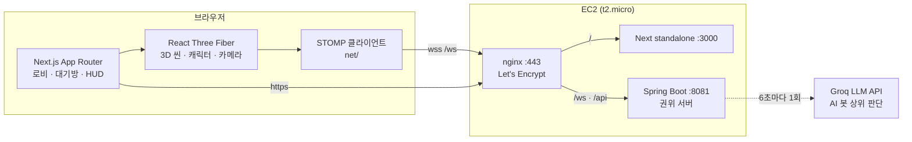
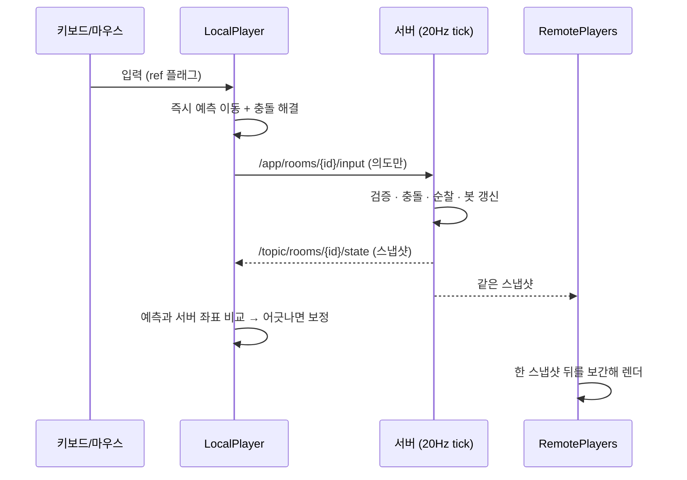
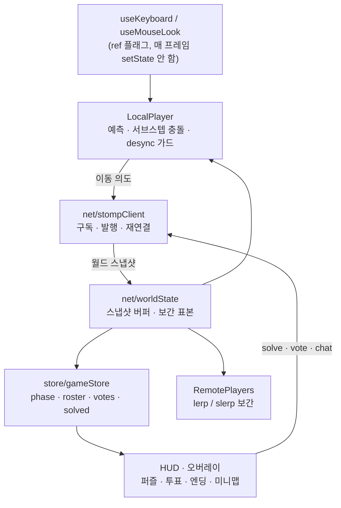

# 시야 밖으로 : Escape — 프론트엔드

실시간 멀티플레이 **3D 협동 방탈출** 게임의 웹 클라이언트입니다.
브라우저에서 바로 돌아가고, 설치할 것이 없습니다.

- 데모: **https://sub.kljj.cloud**
- 짝 저장소(백엔드): [`hideAndSeek_back`](https://github.com/Jakelee0424/hideAndSeek_back) — Spring Boot 권위 서버

---

## 게임 소개

교도소에 갇힌 수감자 넷이 **자정까지 탈옥**해야 합니다. 그중 하나는 사람이 아닙니다.

| 단계 | 이름 | 길이 | 하는 일 |
|---|---|---|---|
| `LOBBY` | 대기 중 | — | 방 코드로 모여 준비 → 방장이 시작 |
| `PLAY` | 탈옥 | 15분 | 감방 탈출 → 별관 퍼즐로 표식 수집 → 배수관·정문 |
| `VOTE` | 색출 | 5분 | "누가 AI였나" 지목 투표 → 결말 연출 |
| `ENDED` | 자정 | — | 정체 공개 |

**협동이 규칙으로 강제됩니다.** 정문 탈옥 코드 4자리는 감방마다 한 자리씩 쪼개져 있고,
해독 규칙도 식당·복도·연병장 세 곳에 나뉘어 있습니다. 자기 표식 하나로는 자기 자리 숫자밖에
못 구하므로 반드시 서로 말해야 합니다(`game/escapePlan.ts`).

**정기 순찰** — 한 판에 1~2회, 간수 둘이 복도를 돕니다. 4초 예고 뒤 부채꼴 시야(14m / 75°)
안에서 움직이거나 무언가를 건드리면 걸리고, 걸리면 **자정이 1분 앞당겨집니다.** 시스템이
조작을 막지는 않습니다 — 멈추는 건 플레이어 몫입니다.

**결말은 두 축의 조합**입니다(`game/endings.ts`).

|  | AI 지목 성공 | AI 지목 실패 |
|---|---|---|
| **탈출 O** | 완전한 탈출 | 재수감 |
| **탈출 X** | 절반의 진실 | 최악의 밤 |

### 퍼즐 구성

| 위치 | 퍼즐 | 보상 |
|---|---|---|
| 감방 A~D | 아케이드 미니게임 한 판 (테트리스·벽돌깨기·스네이크·슈터·두더지·리듬 6종 중 배정) | 그 감방문이 열린다 |
| 작업장 | 도구 이름 → 숫자 규칙 찾기 | 방 벽에 표식 |
| 식당 | ① 요일별 배식 코드로 입장 ② 식단표·식판으로 칼로리 합 계산 → 냉장고 | 방 벽에 표식 |
| 의무실 | ① 혈액형 복원 ② 접촉 기록에서 최초 감염자 지목 | 방 벽에 표식 |
| 세탁실 | ① 배관 노선도대로 밸브 돌리기 ② 관리 기호가 모두 맞는 옷 고르기 | 방 벽에 표식 |
| 배수관 | 거짓말 탐정 — 진술에서 진실을 가려 표식 4개를 제자리에 | 탈출로 개방 |
| 정문 | 표식·수 조각을 모아 계산한 4자리 코드 | 탈옥 |

퍼즐 문제와 정답은 전부 **방 코드를 시드로 매판 새로 생성**됩니다. 같은 방 사람들은 같은
문제를 보고, 다른 방은 다른 답을 봅니다. 서버 없이 클라이언트가 결정론적으로 만들어 냅니다.

---

## 기술 스택

| 영역 | 사용 |
|---|---|
| 프레임워크 | Next.js 16 (App Router) · React 19 · TypeScript strict |
| 3D | React Three Fiber 9 · three.js 0.185 · @react-three/drei |
| 실시간 | @stomp/stompjs 7 (WebSocket) |
| 상태 | zustand 5 |
| 스타일 | Tailwind CSS 4 |

---

## 빠른 시작

```bash
npm install
cp .env.example .env.local     # 백엔드 주소 설정
npm run dev                    # http://localhost:3000
```

```bash
# .env.local
NEXT_PUBLIC_API_URL=http://localhost:8080
NEXT_PUBLIC_WS_URL=ws://localhost:8080/ws
```

> ⚠️ `NEXT_PUBLIC_*`는 **빌드 타임에 번들에 박힙니다.** 주소가 바뀌면 반드시 재빌드하세요.

백엔드(`hideAndSeek_back`)가 `:8080`에 떠 있어야 로비 이후가 동작합니다.

**혼자 전체 흐름을 보려면 방 코드 `TEST`** 로 들어가세요. 준비·시작을 건너뛰고 즉시 시작하며,
단계가 짧게 돌아 약 2분 15초에 투표·결말까지 도달합니다(개발·시연용 뒷문).

---

## 아키텍처

### 전체 구성



### 권위 서버 모델

**서버가 진실의 원천입니다.** 클라이언트는 좌표를 보내지 않고 **이동 의도**(방향·시점·달리기·점프)만
보냅니다. 좌표를 그대로 믿으면 위조가 가능하고, 마지막이 "말과 행동을 근거로 AI를 지목하는 투표"라
위조 하나가 게임 전체를 무너뜨리기 때문입니다.



핵심 세 가지:

1. **client-side prediction** — 내 캐릭터는 입력 즉시 움직입니다. 왕복 지연을 기다리지 않습니다.
2. **reconciliation (desync 가드)** — 매 프레임 서버 좌표와 비교합니다. 서버 표본이 도착한
   *그 시각에 내가 예측했던 위치*(`posHist`)와 견주므로, 정상적인 예측 리드를 오차로 오인하지
   않습니다. 3~8m는 부드럽게 끌어당기고, 8m를 0.4초 넘게 유지하면 하드 스냅합니다.
3. **interpolation delay** — 남의 캐릭터는 스냅샷 하나만큼 과거를 그립니다. 지터가 흡수됩니다.

### 충돌 — 프레임이 길어져도 벽을 뚫지 않게

원-AABB 밀어내기는 **도착점만** 봅니다. 프레임이 길어지면 한 프레임 이동 거리가 벽 두께(0.4m)를
넘어 그대로 관통합니다. 그래서 이동을 `MAX_STEP_M`(0.18m) 이하 조각으로 나눠 **조각마다** 충돌을
풀고, `MAX_DT`(0.1s) 상한을 둡니다. 서버도 같은 방식으로 서브스텝을 밟습니다.

### 프론트 내부 데이터 흐름



**문 열림은 상태를 따로 동기화하지 않습니다.** 서버가 매 tick 브로드캐스트하는 `solvedIds`에서
파생시킵니다(`openDoorsFromSolved`) — 누가 풀든 모두에게 동시에 열립니다.

---

## 디렉터리

```
app/                 Next.js 라우트 (/ · /rooms/[id] · /rooms/[id]/play)
components/          UI 오버레이 — 로비 · 대기방 · HUD · 퍼즐 · 투표 · 엔딩 · 미니맵
game/                3D 씬과 게임 로직
  Scene.tsx            <Canvas> 루트
  LocalPlayer.tsx      입력 · 예측 · 충돌 · desync 보정
  RemotePlayers.tsx    원격 플레이어 보간
  Map.tsx              교도소 지오메트리
  collision.ts         원-AABB 충돌 (⚠️ 서버 Collision.java와 이중 관리)
  interactables.ts     상호작용 오브젝트 정의 + 퍼즐 배치
  escapePlan.ts        탈옥 코드 분배 (⚠️ 서버 EscapePlan.java와 시드 규약 일치)
  cafeteriaPlan.ts     식당 퍼즐 / laundryPlan · infirmaryPlan · liarPuzzle · toolCode
  minigames/           아케이드 6종 + 방 코드별 배정
  PatrolGuards.tsx     순찰 간수 · 시야 부채꼴
net/                 STOMP 클라이언트 · 월드 상태 · 대기열 · 세션
store/               zustand (게임 상태 · 알림 · 사운드)
public/              사운드 · 이미지 · 3D 에셋
```

---

## 서버와의 통신 규약

STOMP 엔드포인트: `/ws`

| 방향 | 목적지 | 용도 |
|---|---|---|
| 클라 → 서버 | `/app/rooms/{id}/join` | 입장 (닉네임 · 대기열 토큰) |
| 클라 → 서버 | `/app/rooms/{id}/input` | 이동 의도 (좌표 아님) |
| 클라 → 서버 | `/app/rooms/{id}/solve` | 퍼즐 해결 |
| 클라 → 서버 | `/app/rooms/{id}/ready` · `/start` | 대기방 준비 · 시작 |
| 클라 → 서버 | `/app/rooms/{id}/vote` | AI 지목 |
| 클라 → 서버 | `/app/rooms/{id}/punch` · `/chat` · `/door` | 펀치 · 발화 · 문 토글 |
| 서버 → 클라 | `/topic/rooms/{id}/state` | 월드 스냅샷 (20Hz) |
| 서버 → 클라 | `/topic/rooms/{id}/chat` | 채팅·감정표현 |

REST는 접속 대기열만 씁니다 — `POST /api/queue` · `GET /api/queue/{playerId}` · `DELETE /api/queue/{playerId}`.

> ⚠️ **발화자·투표자·펀치 주체는 페이로드로 받지 않습니다.** 전부 STOMP 세션에 묶인 `playerId`로
> 정합니다. 남의 이름으로 말하거나 표를 던질 수 있으면 색출 투표가 성립하지 않습니다.

스냅샷은 대역폭을 아끼려고 **바뀔 때만 싣는 필드**를 구분합니다. 위치(`states`)·열린 문·간수는 매
tick, 로스터·단계·투표·준비 상태는 바뀔 때와 입장 시에만 실립니다(`WorldSnapshot`).

---

## R3F 렌더링 규칙 (성능 직결)

1. **매 프레임 `setState` 금지.** 프레임마다 바뀌는 값은 `useRef`로 들고 `useFrame` 안에서
   `mesh.position` 등을 직접 씁니다. state로 넣으면 매 프레임 리렌더 → 프레임 드랍.
2. `Vector3` · `Quaternion` 같은 재사용 객체는 컴포넌트 밖이나 ref에 **한 번만** 만듭니다.
3. zustand 구독은 **필요한 값만** 좁힙니다. `s.nearId`를 통째로 구독해 오브젝트 24개가 전부
   리렌더되던 전례가 있습니다 — 불리언으로 좁혀 해결했습니다.
4. three는 재질을 **처음 그리는 프레임**에 셰이더를 동기 컴파일합니다. `<Preload all />`로
   로딩 단계에 몰지 않으면 새 구역에 들어설 때마다 한 번씩 멈춥니다.
5. 화면에 나올 수 없는 그림자(지붕 아래 가구 등)는 `castShadow`를 끕니다.

**F3** 을 누르면 FPS · 최근 2초 최악 프레임 ms · 드로우콜 · 삼각형 · 셰이더 수가 뜹니다
(`components/PerfStats.tsx`). 성능 이야기는 이 숫자에서 시작합니다.

---

## 배포

로컬에서 빌드해 EC2로 올립니다(서버는 1 vCPU라 원격 빌드가 위험합니다).

```bash
NEXT_PUBLIC_WS_URL=wss://sub.kljj.cloud/ws npm run build
# .next/static · public 을 .next/standalone 에 복사 → tar → scp
# 서버에서 전개 후: sudo systemctl restart hideandseek-front
```

- nginx(443, Let's Encrypt) → `/`는 Next standalone `:3000`, `/ws`·`/api/`는 Spring `:8081`
- https 페이지라 **wss 필수** (평문 ws는 mixed content로 차단)
- `/ws`에 `proxy_read_timeout 3600s` 필요 — 기본 60초면 게임 중에 끊깁니다
- 프로세스는 systemd(`hideandseek-front`)가 관리합니다. 직접 `nohup`으로 띄우지 마세요

---

## 작업할 때 주의 — 서버와 이중 관리되는 값

한쪽만 고치면 조용히 어긋납니다. **반드시 양쪽을 같이** 고치세요.

| 값 | 프론트 | 백엔드 |
|---|---|---|
| 이동 속도 · 달리기 배수 · 점프 · 중력 | `game/LocalPlayer.tsx` | `application.yml` `game.*` |
| 서브스텝 한계 `MAX_STEP_M` (0.18) | `game/collision.ts` | `Room.java` |
| 장애물 · 맵 경계 · 문 박스 | `game/collision.ts` · `Map.tsx` | `Collision.java` |
| 탈옥 코드 시드 규약 (해시 · 난수 소비 순서) | `game/escapePlan.ts` | `EscapePlan.java` |
| 상호작용 오브젝트 좌표(봇 순회 POI) | `game/interactables.ts` | `Interactables.java` |

커밋 메시지는 **한글**로 씁니다.
